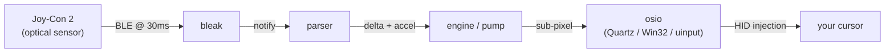

# Joyglide

[](https://github.com/opsthomaz/joyglide/actions/workflows/build.yml)
[](https://github.com/opsthomaz/joyglide/actions/workflows/lint.yml)
[](https://github.com/opsthomaz/joyglide/actions/workflows/codeql.yml)
[](pyproject.toml)
[](LICENSE)

> Use a Nintendo Switch 2 Joy-Con as a desktop mouse on macOS and Windows.

The Joy-Con 2 has an optical sensor on the bottom, just like a regular mouse. This app pairs it over Bluetooth Low Energy and turns the cursor movement into a real macOS / Windows mouse — sub-pixel motion, click on `L`/`R` (left) and `ZL`/`ZR` (right) — swappable in Settings — scroll on the analog stick, battery readout, the works.



---

## Table of contents

- [Quick start](#quick-start)
- [Features](#features)
- [Performance](#performance)
- [How we verify](#how-we-verify)
- [Compatibility](#compatibility)
- [Project layout](#project-layout)
- [Documentation](#documentation)
- [Credits](#credits)
- [Contributing](#contributing)
- [License](#license)

---

## Quick start

### macOS

Pre-built `.app` bundle (`Joyglide-macos.zip`) is published on the [Releases page](../../releases) starting with the v0.1.0 tag. Built automatically by CI on every tag.

To build from source:

```bash
git clone https://github.com/opsthomaz/joyglide.git
cd joyglide
python3.13 -m venv .venv
source .venv/bin/activate
pip install -r requirements.txt
python main.py
```

First launch will ask for **Accessibility** permission (System Settings → Privacy & Security → Accessibility). Without it the app can see the Joy-Con but can't move the cursor.

### Windows

Pre-built `.exe` (`Joyglide.exe`) is published on the [Releases page](../../releases) starting with the v0.1.0 tag.

To build from source — see [`docs/WINDOWS.md`](docs/WINDOWS.md) for the full guide. TL;DR:

```powershell
py -3.13 -m venv .venv-win
.\.venv-win\Scripts\Activate.ps1
pip install -r requirements.txt
python main.py
```

> Requires Python **3.13 or newer**. All BLE / UI deps ship native wheels for 3.13 and 3.14.

### How to connect a Joy-Con

1. Make sure Bluetooth is on.
2. Open the app and click **+ Sync New Controller**.
3. On the Joy-Con, hold the small sync button (between `SL` and `SR` on the rail) for ~2 seconds until the four player LEDs march back and forth.
4. The app finds and connects in ~5 seconds.
5. Lay the Joy-Con flat on the desk with the optical sensor (the small black square between `ZL`/`ZR`) pointing down. Move it like a mouse.

---

## Features

- **Three motion profiles** with distinct feel:
  - 🚀 **Dynamic** (default) — smart speed-² acceleration, smooth pump-interpolated cursor at display refresh.
  - 🎯 **Gaming / FPS** — raw 1:1, zero deadzone, pump bypassed for true minimum input lag.
  - 🍿 **Cinematic** — slow drain + extended idle inertia tail, masks hand tremors when waving the controller around.
- **Sub-pixel cursor motion** (Quartz on macOS native; software-accumulated on Windows).
- **Per-profile idle brake** so each profile has its own "stop" character.
- **Adaptive drain factor** — the pump's drain ratio auto-adjusts to whatever BLE rate the OS negotiated (33 Hz on macOS, ~67 Hz on Windows). Same code, no toggles.
- **Battery indicator** parsed live from input report `0x05` (offsets per ndeadly's research; current-scale `raw / 100 = mA` cross-validated against Nadeflore's `switch2-controllers` driver + an 818 s hardware capture — pinned Tier S).
- **Global pause hotkey** — `Ctrl+Alt+M` (Win) / `⌃⌥M` (Mac) freezes input without disconnecting. Resume is instant.
- **Multiple controllers** — pair as many Joy-Cons as you want; each gets its own row in the dashboard with battery, side toggle, and disconnect button.
- **Switch left ↔ right** at runtime without disconnecting (re-maps button masks in place).
- **Scroll** via the analog stick (cubic curve in Dynamic / Cinematic, linear in Gaming).
- **Vibration on connect** + tray "Say hi" debug button.
- **Cross-platform** with native APIs in each backend — no Electron, no Qt, no abstraction tax.

---

## Performance

| Stage | macOS | Windows |
|---|---|---|
| BLE link layer interval | 30 ms (Apple cap) | 15 ms via `BluetoothLEPreferredConnectionParameters.ThroughputOptimized` |
| Effective input rate | ~33 Hz | **~67 Hz** (2× macOS) |
| Cursor injection | `CGEventPost` (sub-pixel float native) | `SendInput` + `MOUSEEVENTF_MOVE_NOCOALESCE` (cached struct, declared argtypes) |
| Pump rate | display refresh (60 / 120 Hz) | display refresh (60 / 120 Hz) |
| Process priority | `NSActivity` (UserInitiated + LatencyCritical) + USER_INTERACTIVE thread QoS | `HIGH_PRIORITY_CLASS` + `SetThreadExecutionState` |
| Timer resolution | nominal | `timeBeginPeriod(1)` (1 ms) |
| Typical end-to-end latency | ~40 ms | ~25 ms |

We hit a hard ceiling on macOS that can't be moved in pure software (Apple enforces ≥30 ms LL interval for non-HID-over-GATT BLE peripherals). See [`docs/ARCHITECTURE.md`](docs/ARCHITECTURE.md) and [`docs/RESEARCH.md`](docs/RESEARCH.md) for the full investigation, including a write-up of every workaround we tested and why each one fails.

**Userspace overhead (measured, not estimated):** the Joyglide pipeline from BLE notification callback to `CGEventPost` return runs at **p50 ~110 µs / p95 ~163 µs** at steady state on Apple Silicon — under 1% of the 30 ms BLE LL interval budget. Methodology + full results + reproduction recipe in [`docs/RESEARCH.md` §6](docs/RESEARCH.md). Re-runnable any time via the built-in `latency_trace` instrumentation (off by default, zero cost when off).

Linux (BlueZ) can in principle reach **5 ms / 200 Hz** — the same rate the Switch console itself uses. **Linux support is experimental** in this v0.1.0 release: the backends are present (`osio/mouse/linux.py` via uinput, `osio/hotkey/linux.py` via evdev, `osio/boost.py` via `hcitool lecup`) but have not been hardware-verified yet. Confirmation reports from Linux users are welcome.

---

## How we verify

Joyglide treats the BLE / HID pipeline as a verifiable system, not a "works on my machine" hack. Five distinct mechanisms enforce that:

| Mechanism | What it catches | Where |
|---|---|---|
| **200+ tests** (pytest + Hypothesis property tests) | Per-parser shape + exact-value regressions, denormal handling, wraparound math | `tests/` (5 hard CI gates listed below) |
| **Cosmic-ray mutation testing** | Tests that *execute* lines but don't actually *assert* the semantics. `parser/battery.py` sits at **93% killable mutation score** with the surviving ~7% all documented equivalents (CPython interning artifacts, intentionally tolerant rounding, logging-only branches) | `tests/test_battery.py` docstring + `./packaging/run_cosmic_ray.sh parser/<module>.py` |
| **Tier-rated protocol claims** (S/A/B/C/D/F) | "Just a comment" facts about the BLE protocol drifting from what hardware actually does | Per-claim citations in `parser/`, `ble/`; rule in `CLAUDE.md` §5 |
| **Import-linter contracts (5)** | Architectural layering violations — `parser/` can't reach `ui/`, `osio/` is leaf, etc. | `.importlinter`, hard-fail in CI |
| **Latency instrumentation** | Performance claims drifting from reality. The "<1% of BLE budget" claim in the Performance section above is *measured*, not estimated | `latency_trace.py` + `docs/RESEARCH.md` §6 |

The 5 hard CI gates ("Passes" per `CLAUDE.md` §5): 150+ tests green · `ruff check` clean · `pyright` 0 errors/0 warnings · `lint-imports` 5/5 contracts · `xenon` complexity under cap (max C / avg A).

---

## Compatibility

### macOS

The pre-built `.app` is **arm64 native** (Apple Silicon). Intel Macs run via Rosetta 2 (macOS prompts to install on first launch — fully transparent).

| Mac | Status | How |
|---|---|---|
| Apple Silicon (M1, M2, M3, M4 — any model) | ✅ Native | Optimal performance |
| Intel Mac with macOS 11–26 | ✅ Via Rosetta 2 | Transparent, slight overhead (~10–25%); macOS 27 is Apple-silicon-only |
| PowerPC / pre-2012 Macs | ❌ Not supported | No BLE, no modern frameworks |

Minimum macOS: **Big Sur 11.0** (`LSMinimumSystemVersion`); developed and hardware-tested on macOS 26.

Bluetooth: any Mac shipped from 2012 onward has BLE 4.0+ — no extra hardware needed.

### Windows

The pre-built `.exe` is **x86_64**.

| PC | Status | BLE rate |
|---|---|---|
| Windows 11 (any build) on x64 | ✅ | ~67 Hz (full ThroughputOptimized boost) |
| Windows 10 1703+ (Creators Update, April 2017) on x64 | ✅ | ~67 Hz |
| Windows 10 < 1703 on x64 | ⚠️ App runs | ~16 Hz fallback (API not available) |
| Windows 11/10 ARM64 (Surface Pro X / Snapdragon X) | ⚠️ Untested | Should run via x64 emulation |
| Windows 8.x and older | ❌ Not supported | No WinRT BLE |

Bluetooth: requires a BLE 4.0+ adapter — built into essentially every laptop made since 2014 and any USB BT 4.0 dongle works on desktops.

### Linux (experimental)

| Distro | Status | Notes |
|---|---|---|
| Any modern Linux + BlueZ + evdev/uinput | ⚠️ Experimental | Backends present (`osio/mouse/linux.py`, `osio/hotkey/linux.py`, `osio/boost.py` Linux branch via `hcitool lecup`) but **not hardware-verified at v0.1.0**. With BlueZ, 5 ms / 200 Hz is in principle reachable — the same rate the Switch console uses. Confirmation reports welcome. |

### What's not yet supported

- **Native universal2 macOS binary** (single .app for arm64 + x86_64 without Rosetta) — would require all dependency wheels installed with `--platform macosx_*_universal2`, which complicates the CI pipeline. Open to a contribution.
- **Windows on ARM native** — the build currently produces x64 only. Windows handles x64 → ARM emulation reasonably, so it works, just not optimally.

### Required permissions

| Platform | Permission | Why |
|---|---|---|
| macOS | **Accessibility** (System Settings → Privacy & Security) | Required for `CGEventPost` to inject cursor events. |
| macOS | **Bluetooth** | First time the app scans, macOS asks. |
| Windows | None | `SendInput` and BLE work without elevation. |

---

## Project layout

The codebase is organized in a layered package structure. Each layer has
a single responsibility and depends only on the layers below it —
enforced by import-linter contracts in CI. Adding a new OS or feature
is a localized change, not a rewrite.

```
main.py                  entry point: BLE lifecycle orchestration + __main__
joycon.py                JoyCon class — thin coordinator over parsers + pump
player.py                Player model (one per connected controller)
solo_logic.py            BLE notification dispatcher → parser delegates
user_preferences.py      JSON-backed settings (platformdirs)
utils.py                 decode_joystick + resource_path helpers
applog.py                centralised logging configuration
tray.py                  pystray icon + menu (no Tk calls; queue-only)
bg_loop.py               singleton asyncio bg loop for fire-and-forget coros

ble/                     ─────── Joy-Con 2 BLE protocol layer ─────────
  constants.py           UUIDs, manufacturer ID, command/subcommand IDs
  feature_flags.py       FEATURE_BUTTON / STICK / IMU / MOUSE / RUMBLE / ...
  protocol.py            write_command, set_leds, enable_mouse, vibration
  connection.py          scan_device, connect_and_setup, reconnect loop

parser/                  ─────── input report 0x05 decoders ──────────
  constants.py           byte offsets (mouse 0x10-0x17, battery 0x1F-0x23)
  button_masks.py        left/right Joy-Con button bitmask layout
  u16_delta.py           wrap-aware signed delta helper
  battery.py             voltage / charge / current parser
  buttons.py             bitmask diff → click events
  mouse_optical.py       absolute X/Y → wrap-aware delta + accel curves
  sticks.py              12-bit packed stick → scroll accumulator
  imu.py                 18-byte Motion Data block (timestamp + accel + gyro)
  magnetometer.py        6-byte mag block at offset 0x19 (s16 X/Y/Z)
  power_info.py          side-specific Power Info bitfield (0..9 SoC, charging)

engine/                  ─────── motion engine + tuning ───────────────
  tuning.py              pump constants (idle brake, max delta, cutoff)
  motion_pump.py         async coroutine — drains accumulator @ display Hz
  predictor.py           optical-velocity inter-packet prediction (opt-in)

osio/                    ─────── OS-specific I/O dispatchers ──────────
  boost.py               priority + anti-throttle + BLE rate negotiation
  mouse/                 cursor injection (macos.py = Quartz, windows.py = SendInput, linux.py = uinput)
  hotkey/                global pause hotkey (macos = CGEventTap, windows = RegisterHotKey, linux = evdev)

ui/                      ─────── customtkinter dashboard ──────────────
  __init__.py            JoyglideUI = MRO(Dashboard + Performance + Settings)
  _shared.py             shared widget helpers + palette across mixins
  dashboard.py           DashboardMixin — controller list + battery
  performance.py         PerformanceMixin — profile + sliders
  settings_tab.py        SettingsMixin — toggles + reset
  modals/
    accessibility.py     show(parent) — macOS Accessibility prompt + TCC reset
    joy_select.py        show(parent, controller_id, player) — left/right picker

packaging/               PyInstaller specs, build scripts, icons sources
.github/workflows/       CI: build (macOS+Windows), lint+test, CodeQL
.importlinter            architectural contract definitions

CHANGELOG.md             version-by-version release notes
LICENSE                  GPL-3.0-or-later
NOTICE                   heritage + dependency licensing breakdown

docs/                    technical deep-dives
├── ARCHITECTURE.md      GATT profile, command IDs, motion pipeline
├── RESEARCH.md          the 33 Hz wall and how we got there empirically
├── WINDOWS.md           Windows-specific build, run, and tweak guide
├── TROUBLESHOOTING.md   common issues (TCC stale, convert_to null, etc.)
└── ROADMAP.md           planned features / contribution opportunities

.github/                 community + CI
├── CONTRIBUTING.md      how to set up a dev env + open a PR
├── CODE_OF_CONDUCT.md   community guidelines
├── SECURITY.md          vulnerability disclosure policy
├── SUPPORT.md           where to get help
├── PULL_REQUEST_TEMPLATE.md
├── ISSUE_TEMPLATE/{bug_report,feature_request,config}
├── workflows/{build,lint,codeql}.yml
└── dependabot.yml

tests/                   pytest unit + property + mutation tests
```

---

## Documentation

- **[docs/ARCHITECTURE.md](docs/ARCHITECTURE.md)** — GATT profile, input report layouts, command catalog, motion pipeline diagram, latency budget, threading model.
- **[docs/RESEARCH.md](docs/RESEARCH.md)** — the 33 Hz wall, the "Set Report Rate?" descriptor experiment, cross-OS comparison with measured numbers, **§6 empirical latency-budget measurement (Tier S)**.
- **[docs/WINDOWS.md](docs/WINDOWS.md)** — Windows build, settings recommendations (turn off "Enhance pointer precision"), known limitations.
- **[docs/TROUBLESHOOTING.md](docs/TROUBLESHOOTING.md)** — common issues with documented fixes.
- **[docs/ROADMAP.md](docs/ROADMAP.md)** — planned features and contribution opportunities.
- **[CHANGELOG.md](CHANGELOG.md)** — version-by-version release notes.
- **[CLAUDE.md](CLAUDE.md)** — engineering rules + verification standards.
- **[.github/CONTRIBUTING.md](.github/CONTRIBUTING.md)** — dev env setup + PR workflow.
- **[.github/SECURITY.md](.github/SECURITY.md)** — vulnerability disclosure policy.

---

## Credits

This project stands on the shoulders of a lot of reverse-engineering work. In rough order of how much they unblocked:

- **[moutella/joycon2mouse](https://github.com/moutella/joycon2mouse)** — the original macOS app Joyglide descends from. Without their tray-icon scaffolding, settings persistence, GATT enable-mode dance, and pump prototype, none of this would exist. ❤️
- **[TheFrano/joycon2py](https://github.com/TheFrano/joycon2py/)** — the *original* Python port that started this lineage.
- **[ndeadly/switch2_controller_research](https://github.com/ndeadly/switch2_controller_research)** — the gold standard reference for the Joy-Con 2 BLE protocol, command IDs, memory layout, and HID report formats. The battery offsets, the `679d5510` "Set Report Rate?" descriptor, and the input-report structures are all from there.
- **[TheFrano/joycon2cpp](https://github.com/TheFrano/joycon2cpp)** — independent C++ Windows implementation. Validated the `BluetoothLEPreferredConnectionParameters.ThroughputOptimized` approach we use in `osio/boost.py`.
- **[Misaka10571/joycon2-connector](https://github.com/Misaka10571/joycon2-connector)** — another C++ Windows implementation; their vibration sample IDs (`BUZZ`, `FIND`, `CONNECT`, `PAIRING`, `STRONG_THUNK`, `DUN`, `DING`) are documented and worth borrowing.
- **[german77/JoyconDriver](https://github.com/german77/JoyconDriver)** — Wireshark dissector for Switch 2 controller traffic; critical for cross-checking pcap captures.
- **[coffincolors/jc2mouse](https://github.com/coffincolors/jc2mouse)** — Linux userspace driver. Independent confirmation of the GATT UUIDs and enable sequence we use.
- **[Nadeflore/switch2-controllers](https://github.com/Nadeflore/switch2-controllers)** — Python driver that independently arrived at the same input report 0x05 layout and, crucially, the same `raw / 100 = mA` scale for the battery current field at offset 0x22 — cross-validation that pinned that calibration to Tier S in our protocol catalog. (Earlier releases cited the `TropicalCyclone/switch2-controller-driver` fork, since deleted.)
- **[OZORDI/JoyCon2Mac](https://github.com/OZORDI/JoyCon2Mac)** — macOS-native CoreBluetooth + DriverKit driver (needs SIP off). Independent confirmation that the `0xFF` feature mask and the 0x05 + command-response dual subscription work on Apple's BLE stack.

If you're picking up this codebase for further work, **also clone ndeadly's repo into `research/`** for offline reference — it's gitignored from this repo for size reasons, but the docs link to specific files in it.

---

## Contributing

PRs welcome — and **especially welcome if you want to extend compatibility to platforms or hardware we don't currently support**. The codebase is ~6,000 lines of production Python (plus ~3,200 lines of tests), well-commented, and laid out so platform backends slot in cleanly via `sys.platform` dispatchers — adding a new OS is a localized change, not a rewrite.

### High-impact contribution ideas

| Area | Difficulty | Why it matters |
|---|---|---|
| **Linux hardware verification** (Linux backends already shipped in `osio/mouse/linux.py`, `osio/hotkey/linux.py`, `osio/boost.py`) | Medium | The Linux code is present but **untested on hardware** at v0.1.0. Confirmation reports — and any necessary fixes — would graduate Linux from experimental to supported. Linux + BlueZ in principle unlocks **200 Hz native**, the same rate the Switch console uses. |
| **macOS universal2 build** (Apple Silicon + Intel native, no Rosetta) | Easy | Configure CI to install dependency wheels with `--platform macosx_*_universal2` and add `target_arch='universal2'` in the spec. Would shrink Intel install friction to zero. |
| **Windows ARM64 build** | Easy-Medium | Build PyInstaller on `windows-11-arm` runner; spec stays the same. Surface Pro X and Snapdragon X laptops would run native instead of via emulation. |
| **IMU-based motion prediction** | Medium-Hard | Each BLE packet of input report 0x05 carries ONE 18-byte Motion Data sample at offset 0x2A (timestamp + temp + accel + gyro). Same rate as the optical sensor — so on input report 0x05 alone, IMU prediction can't reduce inter-packet latency. The ~6-samples-per-packet claim from earlier docs referenced input reports 0x07/0x08 which carry 40-byte multi-sample motion blocks but in "unknown packed format" per ndeadly. Real win requires reverse-engineering that format AND switching primary subscription from 0x05 to side-specific (which would lose IMU calibration we have, magnetometer at 0x19, and absolute mouse). |
| **Air-mouse mode** | Medium | Use the gyro/IMU as the cursor source (Wii Remote-style) instead of the optical sensor. Useful for media center / presentation use. The hardware data is already in every BLE packet. |
| **Per-axis sensitivity** | Easy | Split `sensitivity` setting into `sensitivity_x` / `sensitivity_y` in `user_preferences.py` and the UI Performance tab. |
| **More controller types** (Pro Controller 2, NSO GameCube) | Easy-Medium | UUIDs and input-report layouts already documented in [`docs/ARCHITECTURE.md`](docs/ARCHITECTURE.md). Mostly extend the parsers in `parser/` and add a controller-type detector in `ble/connection.py:scan_device` (the manufacturer-data byte 5 already identifies controller variants — see [coffincolors/jc2mouse](https://github.com/coffincolors/jc2mouse) `ns2pro.py` for reference). |
| **Localization** (i18n) | Easy | Some Windows reference projects (e.g., `Misaka10571/joycon2-connector`) ship Chinese + English. Could mirror via gettext or a simple JSON dict. |
| **Code signing + notarization** | Medium (requires $99/yr Apple Developer Program + Microsoft cert) | Eliminates the "Apple cannot check this app" warning on macOS and the SmartScreen warning on Windows. |
| **Better installer** (.pkg / .msi instead of .zip / .exe) | Easy | Native installer with permissions setup and Applications symlink. |
| **Sub-pixel cursor on Windows** | Hard | Win32 `SendInput` is integer-only. A virtual HID driver (Interception or DriverKit) could expose true sub-pixel motion. |

### How to start

1. Fork this repo on GitHub.
2. Clone, branch, hack:
   ```bash
   git clone git@github.com:your-username/joyglide.git
   cd joyglide
   git checkout -b feature/your-thing
   python3.13 -m venv .venv && source .venv/bin/activate
   pip install -r requirements.txt
   python main.py    # iterate
   ```
3. Test locally on the platform you're touching. For native build validation:
   ```bash
   ./packaging/build.sh            # macOS .app
   .\packaging\build_windows.ps1   # Windows .exe
   ```
4. Push and open a PR. Doesn't need to be perfect — drafts and "I'm trying X, what do you think?" PRs are fine.

### What we look for in PRs

- **No new dependencies** unless really needed (the project intentionally avoids heavy frameworks — Quartz/Win32 directly, no Qt, no Electron).
- **Cross-platform code stays cross-platform** (don't add `if sys.platform == "darwin"` inside `joycon.py`, `parser/`, `engine/` — those layers are OS-agnostic. Add a new function in `osio/` and have the dispatcher pick the right backend by `sys.platform`).
- **Architectural boundaries are enforced** — `import-linter` runs in CI with five contracts (e.g. `parser/` ↛ `ui/`, `engine/` ↛ `ble/`, `osio/` is a leaf). PRs that violate them fail the build. See `.importlinter`.
- **Pump and BLE rate logic must continue to auto-adapt** — the `_ble_period_ema` in `joycon.py` is what makes the same code feel right on macOS (33 Hz) and Windows (67 Hz). New platforms must hook into it the same way.
- **Comments explain the *why*** when it's not obvious from the code (especially around platform quirks like `convert_to returned null`, `MOUSEEVENTF_MOVE_NOCOALESCE`, `LSUIElement`, etc.). The repo is full of these — copy the style.
- **Don't break either platform** — local validation before pushing is highly encouraged. The CI catches build failures, but not runtime crashes.

### Got a Joy-Con but no time to code?

You can still help:

- **File an issue** with your hardware setup if the app behaves oddly (Mac model, macOS version, JC2 firmware version, BT chip on Windows, etc.).
- **Confirm compatibility** on hardware we haven't tested (any Mac older than M1, any Windows BT chip not in the table above).
- **Test edge cases** — what happens with two Joy-Cons connected? When you put the laptop to sleep mid-session? When the JC2 battery dies during use?

Drop a comment in [Issues](../../issues) — even a "works on my MacBook Air 2017 with Rosetta" report is useful data.

---

## License

**[GPL-3.0-or-later](LICENSE)** — copyleft. You're free to use, modify, and redistribute, but **any derivative work must also be GPL-3.0-or-later** and remain open. See [`LICENSE`](LICENSE) for the full text and [`NOTICE`](NOTICE) for the heritage (this codebase forked from the MIT-licensed [moutella/joycon2mouse](https://github.com/moutella/joycon2mouse); the original code's MIT license is preserved at its origin point).

**Why GPL** instead of the upstream MIT: the maintainer wants forks and derived works to stay accessible to the community rather than being absorbed into closed proprietary products. Attribution is mandatory either way.

### Third-party dependency licensing

The shipped binaries embed several third-party libraries. All are GPL-3.0-compatible:

| Dependency | License | Compatibility note |
|---|---|---|
| `bleak`, `pillow`, `customtkinter`, `platformdirs`, all `pyobjc-framework-*` | MIT (or MIT-style) | Permissive — fully GPL-compatible. Source-only attribution preserved. (`py2app` was used during early development for macOS bundling but is not included in the shipped PyInstaller-built binaries.) |
| `pystray` | LGPL-3.0 | LGPL-3.0 is GPL-compatible; the combined binary can be distributed under GPL-3.0, but LGPL's §4 user-replacement requirement applies independently — users of distributed binaries must be able to rebuild with a modified `pystray`. Satisfied by this project's open-source distribution. |
| `pyinstaller` | GPL-2.0-or-later + **bootloader exception** | PyInstaller's [bootloader exception](https://github.com/pyinstaller/pyinstaller/blob/develop/COPYING.txt) explicitly allows distributing the produced bundle under ANY license — including GPL-3.0. Only PyInstaller's own *source* is GPL — frozen output is not derivative of PyInstaller itself. |
